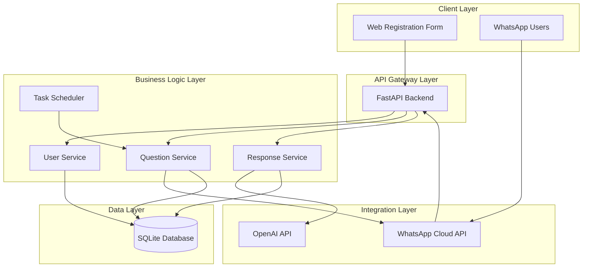
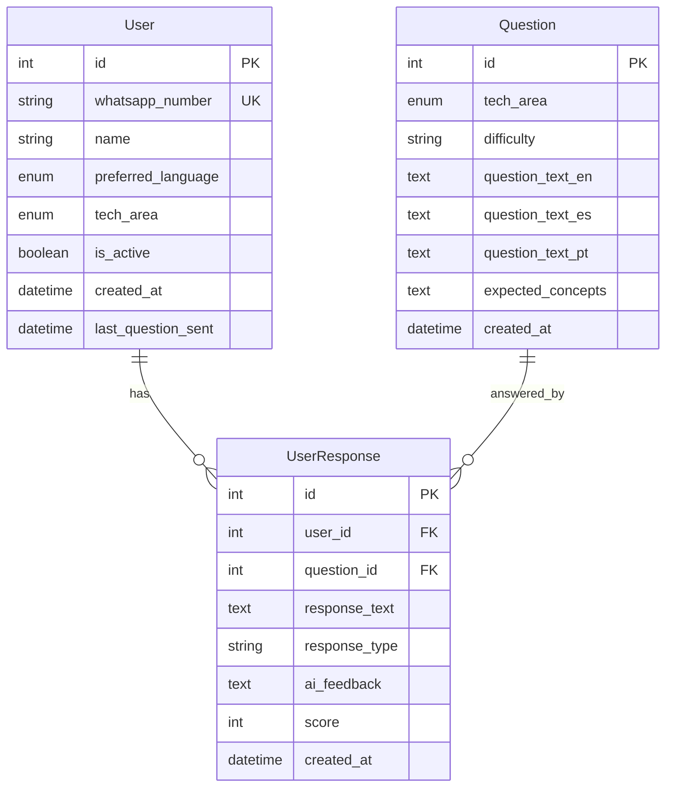

# Design Document

## Overview

The Interview Bot is a WhatsApp-based automated interview training system built with FastAPI, SQLite, and integrated with WhatsApp Cloud API and OpenAI. The system follows a microservices-inspired architecture with clear separation between web registration, WhatsApp messaging, AI processing, and data persistence layers.

The core workflow involves: user registration via web form → daily automated question delivery → user response processing → AI-powered feedback generation → subscription management through WhatsApp commands.

## Architecture

### High-Level Architecture



### Component Architecture

The system is organized into distinct layers:

1. **Presentation Layer**: Web forms and WhatsApp interface
2. **API Layer**: FastAPI endpoints for webhooks and registration
3. **Business Logic Layer**: Core services for user management, question handling, and response processing
4. **Integration Layer**: External API integrations (WhatsApp, OpenAI)
5. **Data Layer**: SQLite database with SQLAlchemy ORM

## Components and Interfaces

### 1. User Management Service

**Responsibilities:**

- Handle user registration from web forms
- Manage user preferences and subscription status
- Process STOP/START commands
- Validate WhatsApp numbers and consent

**Key Methods:**

```python
class UserService:
    async def register_user(user_data: UserRegistration) -> User
    async def unsubscribe_user(whatsapp_number: str) -> bool
    async def reactivate_user(whatsapp_number: str) -> bool
    async def get_active_users() -> List[User]
    async def update_last_question_sent(user_id: int) -> None
```

**Interfaces:**

- REST API endpoints: `/api/users/register`, `/api/users/unsubscribe/{number}`
- WhatsApp webhook integration for STOP/START commands

### 2. Question Management Service

**Responsibilities:**

- Select appropriate questions based on user preferences
- Manage question database and categorization
- Handle multi-language question delivery
- Track question delivery history

**Key Methods:**

```python
class QuestionService:
    async def get_daily_question(user: User) -> Question
    async def send_question_to_user(user: User, question: Question) -> bool
    async def get_questions_by_area(tech_area: TechArea) -> List[Question]
    async def mark_question_sent(user_id: int, question_id: int) -> None
```

**Question Selection Algorithm:**

- Filter by user's technical area (JavaScript, Python, Ruby, DSA)
- Avoid recently sent questions (maintain 30-day history)
- Randomize within difficulty progression
- Fallback to general DSA questions if area-specific unavailable

### 3. Response Processing Service

**Responsibilities:**

- Process incoming WhatsApp messages
- Handle both text and audio responses
- Integrate with OpenAI for response analysis
- Generate personalized feedback

**Key Methods:**

```python
class ResponseService:
    async def process_user_response(user: User, message: WhatsAppMessage) -> None
    async def transcribe_audio(audio_data: bytes) -> str
    async def analyze_response(question: Question, response: str) -> AIFeedback
    async def send_feedback(user: User, feedback: AIFeedback) -> bool
```

**AI Integration Flow:**

1. Receive user response (text or transcribed audio)
2. Combine with original question context
3. Send to OpenAI with structured prompt
4. Parse AI response for feedback and scoring
5. Format and send feedback via WhatsApp

### 4. WhatsApp Integration Service

**Responsibilities:**

- Handle webhook verification and message processing
- Send messages through WhatsApp Cloud API
- Manage message formatting and media handling
- Implement retry logic for failed deliveries

**Key Methods:**

```python
class WhatsAppService:
    async def verify_webhook(hub_challenge: str) -> str
    async def process_webhook(webhook_data: dict) -> None
    async def send_message(phone_number: str, message: str) -> bool
    async def send_welcome_message(user: User) -> bool
```

**Message Types:**

- Welcome messages (registration confirmation)
- Daily questions (formatted by language/area)
- AI feedback responses
- System notifications (unsubscribe confirmations)

### 5. Task Scheduler Service

**Responsibilities:**

- Schedule daily question delivery (9 AM local time)
- Manage recurring tasks and job persistence
- Handle timezone considerations
- Implement failure recovery

**Key Methods:**

```python
class SchedulerService:
    def schedule_daily_questions() -> None
    async def send_daily_questions_batch() -> None
    def schedule_user_specific_task(user: User) -> None
```

**Scheduling Strategy:**

- Use APScheduler with persistent job store
- Single daily batch job at 9 AM UTC
- Individual user timezone handling in business logic
- Exponential backoff for failed deliveries

## Data Models

### Database Schema



### Enums and Constants

```python
class TechArea(enum.Enum):
    JAVASCRIPT = "javascript"
    PYTHON = "python"
    RUBY = "ruby"
    DSA = "dsa"

class Language(enum.Enum):
    ENGLISH = "en"
    SPANISH = "es"
    PORTUGUESE = "pt"

class ResponseType(enum.Enum):
    TEXT = "text"
    AUDIO = "audio"

class Difficulty(enum.Enum):
    EASY = "easy"
    MEDIUM = "medium"
    HARD = "hard"
```

## Error Handling

### Error Categories and Strategies

1. **WhatsApp API Errors**

   - Rate limiting: Implement exponential backoff
   - Invalid numbers: Log and mark user as inactive
   - Network failures: Retry with circuit breaker pattern

2. **OpenAI API Errors**

   - Rate limiting: Queue responses and process with delays
   - API failures: Provide fallback generic feedback
   - Token limits: Truncate long responses intelligently

3. **Database Errors**

   - Connection failures: Implement connection pooling and retries
   - Constraint violations: Handle gracefully with user feedback
   - Data corruption: Implement backup and recovery procedures

4. **User Input Errors**
   - Invalid WhatsApp numbers: Validate format and provide feedback
   - Missing consent: Block registration with clear error message
   - Malformed responses: Process best-effort with AI robustness

### Error Response Format

```python
class ErrorResponse(BaseModel):
    error_code: str
    message: str
    details: Optional[dict] = None
    timestamp: datetime
    request_id: str
```

### Logging Strategy

- Structured logging with JSON format
- Log levels: DEBUG (development), INFO (user actions), WARN (recoverable errors), ERROR (system failures)
- Include correlation IDs for request tracing
- Separate logs for business events vs system events

## Testing Strategy

### Unit Testing

**Coverage Areas:**

- Business logic services (user management, question selection, response processing)
- Data model validation and relationships
- Utility functions (phone number validation, text processing)
- API endpoint logic (excluding external integrations)

**Testing Framework:**

- pytest for test runner
- pytest-asyncio for async test support
- Factory Boy for test data generation
- SQLAlchemy test fixtures with in-memory database

### Integration Testing

**Test Scenarios:**

- End-to-end user registration flow
- WhatsApp webhook processing with mock payloads
- OpenAI integration with mock responses
- Database operations with real SQLite instance
- Scheduler execution with time manipulation

**Mock Strategy:**

- Mock external APIs (WhatsApp, OpenAI) in integration tests
- Use real database for data layer testing
- Mock time-dependent operations for scheduler testing

### API Testing

**Test Coverage:**

- All REST endpoints with various input scenarios
- Webhook endpoint with WhatsApp message formats
- Error handling and edge cases
- Authentication and authorization (if implemented)

**Tools:**

- FastAPI TestClient for endpoint testing
- Postman/Newman for API contract testing
- Load testing with locust for performance validation

### End-to-End Testing

**User Journey Testing:**

1. User registration → Welcome message → First question
2. Question response → AI feedback → Next day question
3. STOP command → Unsubscribe confirmation → No further messages
4. Error scenarios → Appropriate error handling

**Test Environment:**

- Staging environment with test WhatsApp numbers
- Mock OpenAI responses for consistent testing
- Automated test data cleanup procedures

## Security Considerations

### Data Protection

- **PII Encryption**: Encrypt WhatsApp numbers and names at rest
- **Data Retention**: Implement 30-day deletion policy for inactive users
- **Access Control**: Role-based access for admin functions
- **Audit Logging**: Track all data access and modifications

### API Security

- **Webhook Verification**: Validate WhatsApp webhook signatures
- **Rate Limiting**: Implement per-endpoint and per-user rate limits
- **Input Validation**: Sanitize all user inputs and API payloads
- **CORS Configuration**: Restrict cross-origin requests appropriately

### Infrastructure Security

- **Environment Variables**: Store all secrets in environment variables
- **Database Security**: Use connection encryption and access controls
- **Network Security**: Implement HTTPS for all external communications
- **Monitoring**: Set up alerts for suspicious activity patterns

## Performance Considerations

### Scalability Targets

- **Users**: Support up to 10,000 active users initially
- **Messages**: Handle 10,000 daily messages (questions + responses)
- **Response Time**: < 2 seconds for question delivery, < 30 seconds for AI feedback
- **Availability**: 99.5% uptime target

### Optimization Strategies

1. **Database Optimization**

   - Index on frequently queried columns (whatsapp_number, tech_area, created_at)
   - Connection pooling for concurrent requests
   - Query optimization for user selection and response history

2. **Caching Strategy**

   - Cache frequently accessed questions in memory
   - Cache user preferences to reduce database queries
   - Implement Redis for session management (future enhancement)

3. **Async Processing**

   - Use FastAPI's async capabilities for I/O operations
   - Implement background tasks for non-critical operations
   - Queue system for batch processing (future enhancement)

4. **External API Management**
   - Implement circuit breakers for WhatsApp and OpenAI APIs
   - Use connection pooling for HTTP requests
   - Batch operations where possible to reduce API calls

## Deployment Architecture

### Development Environment

- Local SQLite database
- ngrok for webhook testing
- Environment-based configuration
- Hot reload for development efficiency

### Production Environment (Future)

- **Database**: PostgreSQL with connection pooling
- **Application**: Docker containers with health checks
- **Load Balancer**: nginx for request distribution
- **Monitoring**: Prometheus + Grafana for metrics
- **Logging**: Centralized logging with ELK stack
- **Backup**: Automated database backups with retention policy

### Configuration Management

```python
class Settings(BaseSettings):
    # Database
    database_url: str = "sqlite:///./interview_bot.db"

    # WhatsApp API
    whatsapp_token: str
    whatsapp_verify_token: str
    whatsapp_phone_number_id: str

    # OpenAI API
    openai_api_key: str
    openai_model: str = "gpt-4"

    # Application
    debug: bool = False
    log_level: str = "INFO"

    class Config:
        env_file = ".env"
```

This design provides a robust foundation for the Interview Bot system, with clear separation of concerns, comprehensive error handling, and scalability considerations for future growth.
